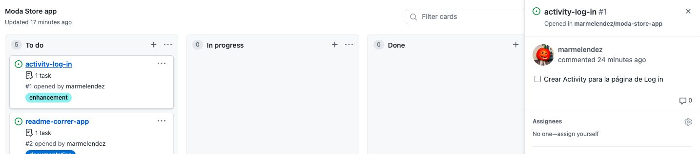

# Contribuir
## ¿Como puedo contribuir?
1. Lo primero es ir al apartado Project del repositorio

2. Selecciona una tarea en la seccion de TO DO 

3. Lee la informacion de cada tarea y si te interesa asigna tu nombre para realizarla

> Nota: Escoge una tarea que no ha sigo asignada a nadie

4. Crea una branch con el siguiente formato: major/minor
Major puede ser:
- `Documentation`
- `Feature`
- `Bugfix or Patch`
- `Styling`

Minor puede ser: 
- el nombre de la tarea que escogiste

Ejemplo:
- `feature/activity-login`
- `documentation/readme`

En esta branch puedes hacer 
`git add`
`git commit`
`git push`
a los cambios que realices.

5. Despues de terminar puedes realizar un `pull request`. 
