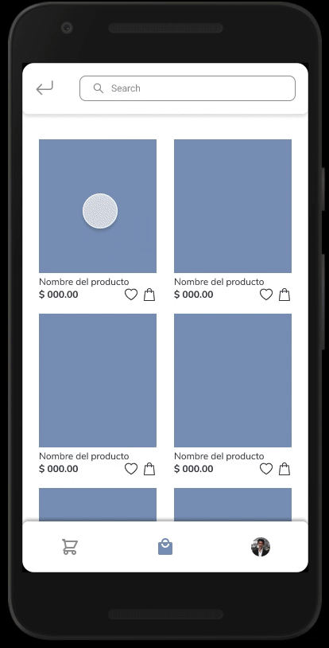

# MODA Store App
Aplicación Android de tienda de ropa Moda Store. 
Este es un proyecto para curso de Desarrollo Movil en Android de Bedu.

## Alcance del Proyecto
Se desarrollará una aplicación para sistema Android mediante la herramienta Android Studio, llamada MODA Store, la cual será una aplicación e-commerce para la venta de ropa en la cual los usuarios podrán visualizar y buscar productos que pertenecen a distintas categorías. Además el usuario tendrá la opción de crear un perfil en la aplicación proporcionando un correo y contraseña lo cual le dará acceso a su lista de favoritos y carrito de compras. También podrá seleccionar un producto y agregarlo al carrito de compras para posteriormente realizar un pedido.  Esta propuesta se basa en la aplicación de la tienda SHEIN.

## Requerimientos
- Android Studio 4.2.2
- SDK: Android 5.0 (Lollipop)

## Correr el programa

## Video
#### Video general
En el siguiente enlace se habla de forma general acerca del funcionamiento de la aplicación

#### Video demostrativo
Si quieres conocer todas las funcionalidades de la aplicación ve este video

## Diseño 
Puedes visualizar los mockups y wireframes meta de este proyecto en el siguiente [link](https://www.figma.com/file/CgTBCmmRmLiYO1QwHiP2KQ/MODA-Store-Project?node-id=0%3A1) 

### Flujo
Tambien puedes checar los flujos dentro de la aplicación en este video
 

## Contribuir
Si te interesa contribuir a este proyecto visita el siguiente documento: [Guia de contribución](https://github.com/marmelendez/moda-store-android-app/blob/master/CONTRIBUIR.md)
