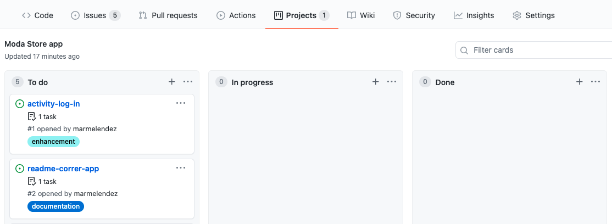
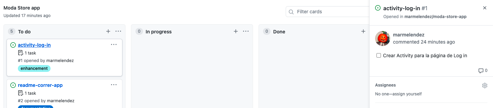
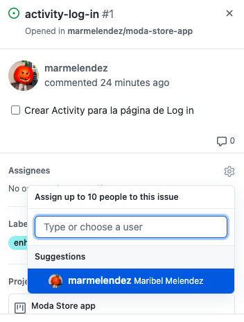
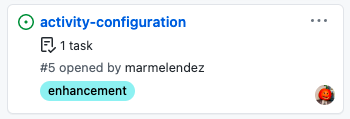

# MODA Store App
Aplicación Android de tienda de ropa Moda Store. 
Este es un proyecto para curso de Desarrollo Movil en Android de Bedu.

## Alcance del Proyecto
Se desarrollará una aplicación para sistema Android mediante la herramienta Android Studio, llamada MODA Store, la cual será una aplicación e-commerce para la venta de ropa en la cual los usuarios podrán visualizar y buscar productos que pertenecen a distintas categorías. Además el usuario tendrá la opción de crear un perfil en la aplicación proporcionando un correo y contraseña lo cual le dará acceso a su lista de favoritos y carrito de compras. También podrá seleccionar un producto y agregarlo al carrito de compras para posteriormente realizar un pedido.  Esta propuesta se basa en la aplicación de la tienda SHEIN.

## Requerimientos
- Android Studio 4.2.2
- SDK: Android 5.0 (Lollipop)

## Correr el programa

## Diseño 
Puedes visualizar los mockups y wireframes meta de este proyecto en el siguiente [link](https://www.figma.com/file/CgTBCmmRmLiYO1QwHiP2KQ/MODA-Store-Project?node-id=0%3A1) 

### Flujo
Tambien puedes checar los flujos dentro de la aplicación en este video
 

## Video
En el siguiente video se muestra el funcionamiento general de la aplicación

## Contribuir
### ¿Como puedo contribuir?
1. Lo primero es ir al apartado Project del repositorio

2. Selecciona una tarea en la seccion de TO DO 

3. Lee la informacion de cada tarea y si te interesa asigna tu nombre para realizarla

> Nota: Escoge una tarea que no ha sigo asignada a nadie

4. Crea una branch con el siguiente formato: major/minor
Major puede ser:
- `Documentation`
- `Feature`
- `Bugfix or Patch`
- `Styling`

Minor puede ser: 
- el nombre de la tarea que escogiste

Ejemplo:
- `feature/activity-login`
- `documentation/readme`

En esta branch puedes hacer 
`git add`
`git commit`
`git push`
a los cambios que realices.

5. Despues de terminar puedes realizar un `pull request`. 
