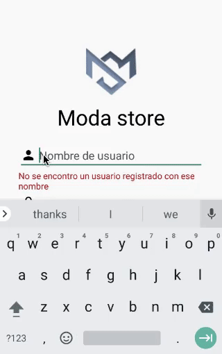

# MODA Store App
Aplicación Android de tienda de ropa Moda Store.  
Este es un proyecto para curso de Desarrollo Movil en Android de Bedu.

## Alcance del Proyecto
Se desarrollará una aplicación para sistema Android mediante la herramienta Android Studio, llamada MODA Store, la cual será una aplicación e-commerce para la venta de ropa en la cual los usuarios podrán visualizar y buscar productos que pertenecen a distintas categorías. Además el usuario tendrá la opción de crear un perfil en la aplicación proporcionando un correo y contraseña lo cual le dará acceso a su lista de favoritos y carrito de compras. También podrá seleccionar un producto y agregarlo al carrito de compras para posteriormente realizar un pedido.  Esta propuesta se basa en la aplicación de la tienda SHEIN.

## Requerimientos
- Android Studio 
- SDK: Android 5.0 (Lollipop)

## Correr el programa
1. Clona el repositorio en tu computadora con `Git clone`
2. Abre el proyecto con Android Studio y corre el programa con un emulador
3. Puedes utilizar los siguientes nombres de usuario y contraseñas para iniciar sesión a la aplicación, los cuales cuentan con algunos datos por default (direcciones, metodos de pago, correo, carrito de compras, favoritos) 

nombre de usuario | contraseña |
--- | --- |
tomas11 | 123 |
didier32 | 1234 |
josearm21 | 12345 |
maribel07 | 123456 |

> Nota: Tambien puedes registrarte como un nuevo usuario 

 

### ¿Que puedes hacer en la aplicación?
Tienes la opción de:
- Iniciar sesión (con algunos de los usuarios de la tabla anterior)
- Registrarte
- Buscar un articulo
- Agregar articula a favoritos o carrito de compras
- Ver tu carrito de compras y realizar compra
- Ver tus favoritos y compras en perfil
- Cambiar configuracion de datos 
- Cerrar sesión

> Nota: Puedes ver el siguiente video para visualizar las funciones de la aplicaciones

### Videos
#### Video general
En el siguiente enlace se habla del proceso y resultado del proyecto [Video](https://youtu.be/p06Q9JMLbKc)

## Diseño 
Puedes visualizar los mockups y wireframes meta de este proyecto en el siguiente [link](https://www.figma.com/file/CgTBCmmRmLiYO1QwHiP2KQ/MODA-Store-Project?node-id=0%3A1) 

### Flujo
Tambien puedes checar los flujos dentro de la aplicación en este video
 

## Contribuir
Si te interesa contribuir a este proyecto visita el siguiente documento: [Guia de contribución](https://github.com/marmelendez/moda-store-android-app/blob/master/CONTRIBUIR.md)
